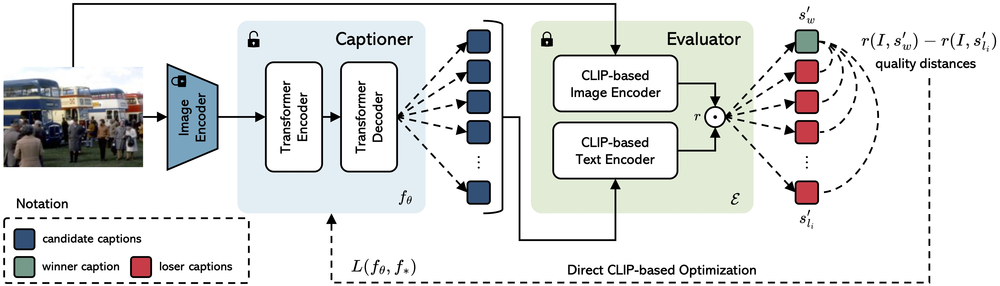

<p align="center">
  
</p>

<h1 align="center"> Revisiting Image Captioning Training Paradigm</br>via Direct CLIP-based Optimization</br>(BMVC 2024)</h1>


<div align='center'>

#### [Nicholas Moratelli](https://nicholasmoratelli.github.io)\*, [Davide Caffagni](https://github.com/dcaffo98)\*, [Marcella Cornia](https://aimagelab.ing.unimore.it/imagelab/person.asp?idpersona=90), [Lorenzo Baraldi](https://www.lorenzobaraldi.com/), and [Rita Cucchiara](https://aimagelab.ing.unimore.it/imagelab/person.asp?idpersona=1)

</div>
<p align="center">
   
</p>

This repository contains the reference code for the paper [Revisiting Image Captioning Training Paradigm via Direct CLIP-based Optimization](https://arxiv.org/pdf/2408.14547), **BMVC 2024**.

Please cite with the following BibTeX:
```
@inproceedings{moratelli2024revisiting,
  title={{Revisiting Image Captioning Training Paradigm via Direct CLIP-based Optimization}},
  author={Moratelli, Nicholas and Caffagni, Davide and Cornia, Marcella and Baraldi, Lorenzo and Cucchiara, Rita and others},
  booktitle={Proceedings of the 35th British Machine Vision Conference},
  year={2024}
}
```

## Abstract

The conventional training approach for image captioning involves pre-training a network using teacher forcing and subsequent fine-tuning with Self-Critical Sequence Training to maximize hand-crafted captioning metrics. However, when attempting to optimize modern and higher-quality metrics like CLIP-Score and PAC-Score, this training method often encounters instability and fails to acquire the genuine descriptive capabilities needed to produce fluent and informative captions. In this paper, we propose a new training paradigm termed *Direct CLIP-Based Optimization* (DiCO). Our approach jointly learns and optimizes a reward model that is distilled from a learnable captioning evaluator with high human correlation. This is done by solving a weighted classification problem directly inside the captioner. At the same time, DiCO prevents divergence from the original model, ensuring that fluency is maintained. DiCO not only exhibits improved stability and enhanced quality in the generated captions but also aligns more closely with human preferences compared to existing methods, especially in modern metrics. Additionally, it maintains competitive performance in traditional metrics.

## Create the environment
```
conda create -y -n "dico" python=3.8.16
conda activate dico
pip install -r requirements.txt
```

## Training
Edit the following scripts with the correct checkpoint paths.
1. **Cross-Entropy pre-training**
```
./scripts/train_xe_coco.sh
```

2. **DiCO fine-tuning**
```
./scripts/train_dico_coco.sh
```

We train and evaluate our models on the [COCO Karpathy splits](https://github.com/karpathy/neuraltalk2). We employ the [webdatasets](https://github.com/webdataset/webdataset) format to prepare our datasets. Every `tar` file complies with the following structure (see also [dataset.json](datasets.json)):
- Cross-entropy
```
├── webdatasets/coco-384-training-000.tar
│   └── 177828__COCO_train2014_000000379613.jpg
│   └── 177828__COCO_train2014_000000379613.txt
│   └── 549457__COCO_val2014_000000195045.jpg
│   └── 549457__COCO_val2014_000000195045.txt
│   └── ...
├── ...
└── webdatasets/coco-384-training-113.tar
    └── ...
```
Every `.txt` file contains a single caption.
- DiCO: fine-tuning | validation | test
```
├── webdatasets/coco-384-training-dict-000.tar
│   └── 177828__COCO_train2014_000000379613.jpg
│   └── 177828__COCO_train2014_000000379613.json
│   └── 549457__COCO_val2014_000000195045.jpg
│   └── 549457__COCO_val2014_000000195045.json
│   └── ...
├── ...
└── webdatasets/coco-384-training-dict-022.tar
    └── ...
```
Every `.json` file contains all the captions for the given image.

## Inference
```
./scripts/inference_coco.sh
```

## DiCO Weights
- [ViT/L-14] The checkpoint is available [here](https://drive.google.com/file/d/19vV-SJYjFKg5-8XfbCQvq8OWB2vVTvpX).

Soon available also on HuggingFace Hub

## Demo
```
python demo.py --checkpoint dico-ViTL14
```
